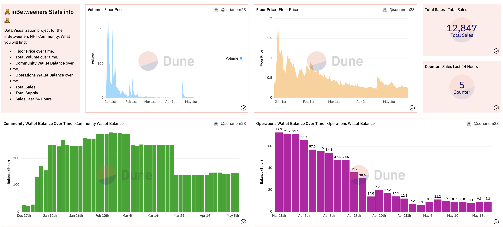
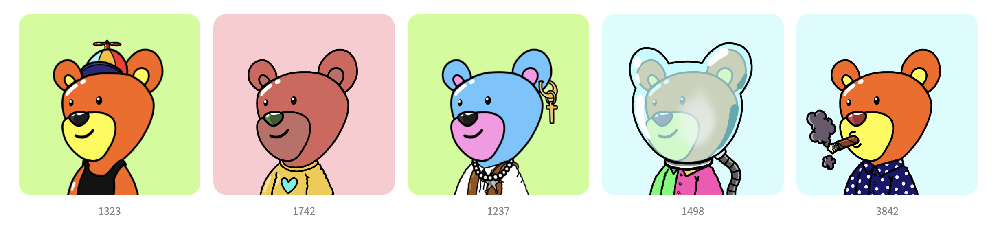

# NFT Dashboard: inBetweeners 🧸
##### Date: May 2022
#### Created by: Maria Soriano 👋🏼

👉🏼 [Check it out here](https://dune.com/sorianom23/inBetweeners-Stats) 👈🏼

Example of visualization

## About
I found myself immersed in the NFT world some time ago. 3 inBetweeners bears were my first NFTs.
After that, I've been very active in the community. At some point I realized that holders where not very familiar to the NFT world. It was their first NFT too and some people didn't heard about NFTs before. They were struggling to understand how the devs and founders were moving the funds. The struggle got even harder when they decided to divide the funds into two different wallets. *Community Wallet* and *Operations Wallet*. At that point I thought it might be interesting to find a way to display the balance for those wallets in a more appealing and visual way. So that people who doesn't know much about it could easily understand and know about the current balance in both wallets, and also the dates when the movements were happening. That would facilitate transparency at the end...

The following dashboard contains the following info:
- **Community Wallet Balance** over time.
- **Operations Wallet Balance** over time.
- **Total Supply.**
- **Total Sales.**
- **Last 24 Hour Sales.**
- **Floor Price** over time.
- **Total Volume** over time.

## Technologies used
* ⚙️ SQL
* 🏜 Dune Analytics: Community-based, open-source data provider which allows anyone to publish and access crypto trends in real-time.

